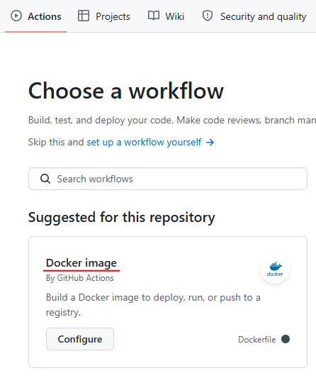

# Итоговый проект курса «DevOps-инженер с нуля» Сафронов П.А.

## 0. Требования
- Должны быть установлены **terraform**, **ansible**, **git**.
- Установка проекта выполняется файлом ```install.sh```

## 1. Инфраструктура
- Скачивание [репоизтория](https://github.com/Briefklammern/terraform-diploma) для создания инфраструктуры.
- Создание инфраструктуры (VPC, Subnet, Compute Instance) выполняется с помощью Terraform на Яндекс Облаке.
- Для развертывания инфраструктуры необходимо создать сервисный аккаунт в вашем облаке, положить его ```authorized_key.json```
  рядом с файлом ```install.sh```
- Необходимо создать в вашем облаке S3 Bucket Storage, подключить к нему ранее созданный сервисный аккаунт, назначить ему роль **storage.editor**,
  создать ему статический ключ доступа. В процессе работы скрипт запросит имя S3 Bucket, secret_key и access_key, и запишет эти данные в ./tf/backend.tfvars
- Так же скрипт запросит ввести ID необходимого облака и папки

## 2. Работа Ansible
- Скачивание [репозитория Ansible](https://github.com/Briefklammern/ansible-diploma)
- Установка Docker на созданную ранее ВМ
- Скачивание и запуск [тестового приложения](https://github.com/Briefklammern/test-app-diploma)
- Сборка образа Docker и отправка его в [Docker Hub](https://hub.docker.com/repository/docker/devillis/test-app-diploma)

> [!NOTE]
> Для отправки контейнера в Docker Hub необходимы креды PAT вашего аккаунта. Создать PAT необходимо в разделе 
> ```https://app.docker.com/accounts/<ИМЯ_ВАШЕГО_АККАУНТА>/settings/personal-access-tokens``` с правами **Repo Read, Write, Delete**
> Созданные креды запрашиваются в ходе работы скрипта, записываются в ./ansible/secret.vars и шифруются ansible-vault с паролем, который так же запрашивается.

## 3. Настройка CI
- В GitHub репозитории приложения в разделе Actions необходимо создать Docker runner
  
